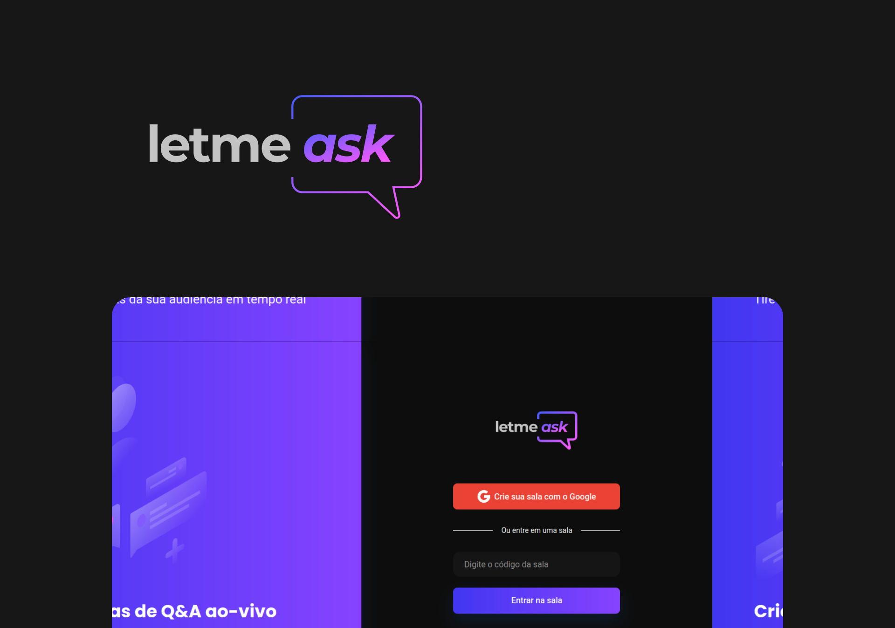

>  project developed during the Next Level Week Together.

## :art: Layout

You can view the project layout in Figma [here](https://www.figma.com/file/u0BQK8rCf2KgzcukdRRCWh/Letmeask)



## :rocket: Challenges:
- [x] Dark Theme
- [x] Notifications with [React Hot Toast](https://react-hot-toast.com/)
- [ ] responsiveness

## :construction_worker: Getting started

Clone the project and access the folder.

```
$ git clone https://github.com/cunhaedu/letmeask.git
$ cd letmeask
```

Follow the steps below:

```
# Install the dependencies
$ yarn

# Start the project
$ yarn start
```

## :rocket:  Technologies

This project was developed using the following technologies:

* [Firebase](https://firebase.google.com/?hl=pt)

* [React](https://pt-br.reactjs.org/)

* [Sass](https://sass-lang.com/)

## :closed_book: Licença

Released in 2021.

This project is under [MIT Licence](https://github.com/cunhaedu/letmeask/tree/main/LICENSE).
